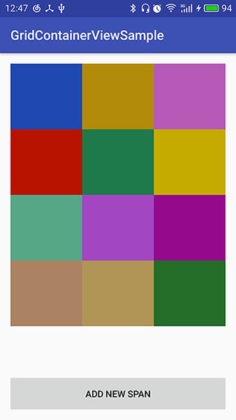

# GridContainerView #
格子容器View，动态添加子View，类似于格子。  
设置GridContainerView为N列。  
当添加的子View超过N，则新增一行，继续添加。  

## 添加依赖 ##
### Step 1. Add the JitPack repository to your build file ###
Add it in your root build.gradle at the end of repositories:

	allprojects {
		repositories {
			...
			maven { url 'https://jitpack.io' }
		}
	}  

## Step 2. Add the dependency ##

	dependencies {
	    compile 'com.github.EthanCo:GridContainerView:1.0.0'
	}

也可使用  
	
	dependencies {
	    compile 'com.github.EthanCo:GridContainerView:-SNAPSHOT'
	}

这将永远使用最新的版本  

## 使用 ##

    <com.ethanco.gridcontainerview.GridContainerView
        android:id="@+id/grid_container_view"
        android:layout_width="400dp"
        app:span_count="3"
        app:span_height="100dp"
        android:layout_height="400dp" />  

### 添加新的span ###

	View spanView = LayoutInflater.from(MainActivity.this).inflate(R.layout.test_span, null);
    gridContainerView.attachNewSpan(spanView);  

### 可使用的属性 ###

    <!--span高度-->
    <attr name="span_height" format="dimension" />
    <!--每一行span的数量-->
    <attr name="span_count" format="integer" />  

### 也可在代码中设置 ###

	gridContainerView.setSpanCount(3); //设置每行span的数量
    gridContainerView.setSpanHeight(100); //设置span高度 dp